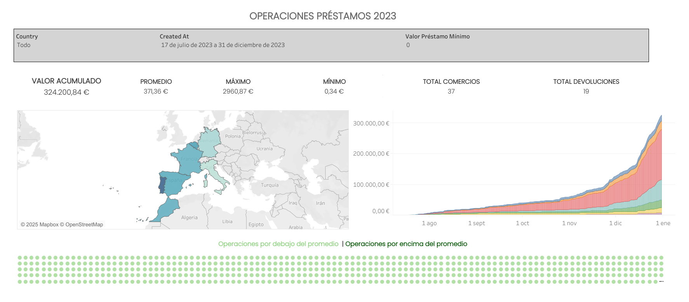
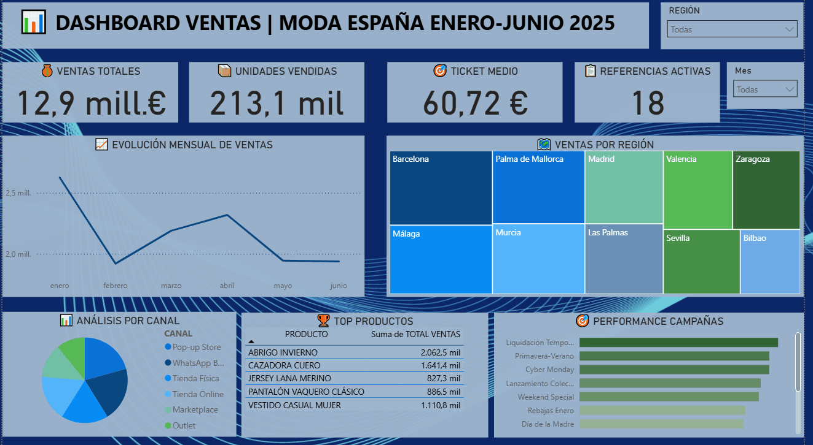

**Portfolio de dashboards**

Dashboards interactivos desarrollados con **Tableau** y **Power BI** para análisis de datos y business intelligence.

**Tecnologías**

- **Tableau Desktop** - Visualización avanzada de datos
- **Power BI Desktop** - Business intelligence e informes interactivos
- **Python/SQL** - Análisis y procesamiento de datos

*Proyectos*

- Dashboards de Tableau

[*Operaciones EasyLoan 2023*]
- **Dashboard:** [Ver Versión Interactiva](https://public.tableau.com/views/PRACTICA_TABLEAU_FERNANDO_APOLO/Dashboard1?:language=es-ES&:sid=&:redirect=auth&:display_count=n&:origin=viz_share_link)
- **Descripción:** Dashboard de operaciones de la empresa EasyLoan del 17 de Julio a 31 de Diciembre de 2023.
- **Tecnologías:** Tableau, Python/SQL

- Dashboards de Power BI

[*KPIs de Ventas Moda 2025*]
- **Descripción:** Dashboard de ventas de moda en España de Enero a Junio de 2025.
- **Tecnologías:** Power BI, DAX, Power Query

**Estructura del repositorio**

tableau/

├── tableau_dashboard_easy_loans.twb

├── tableau_dashboard_easy_loan.pdf

└── datos/

power_bi/

├── portfolio_pbi.pbix

└── datos/

screenshots_gifs/

├── tableau_easyloans.png

└── pbi_ventas_moda_españa.gif

Contacto

- **LinkedIn:** (https://www.linkedin.com/in/fernando-apolo-%C3%A1lvarez-a4a139343/)
- **Email:** apoloalvarezfernando@gmail.com
