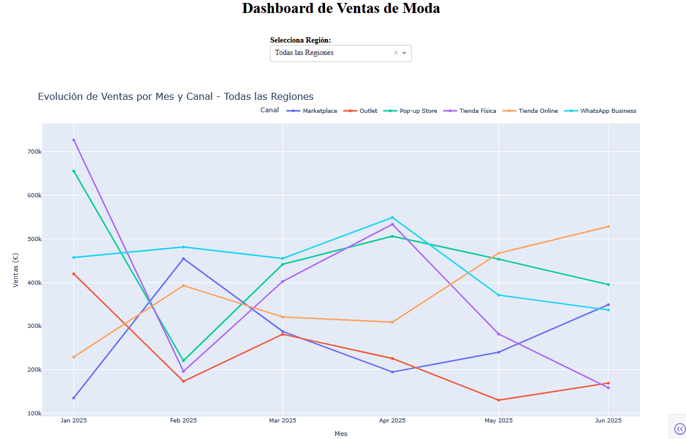
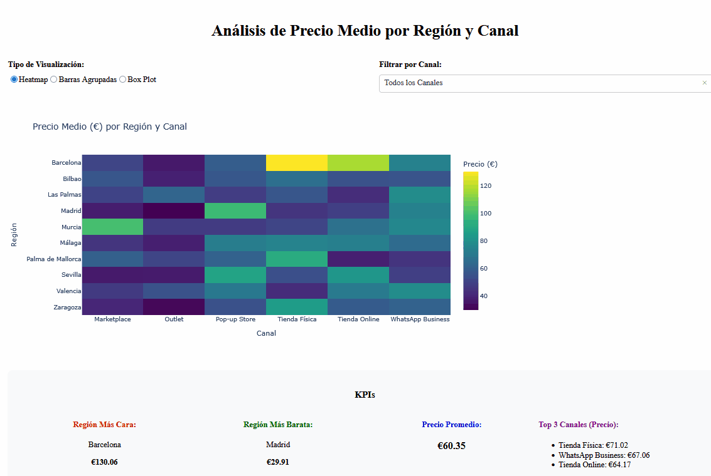
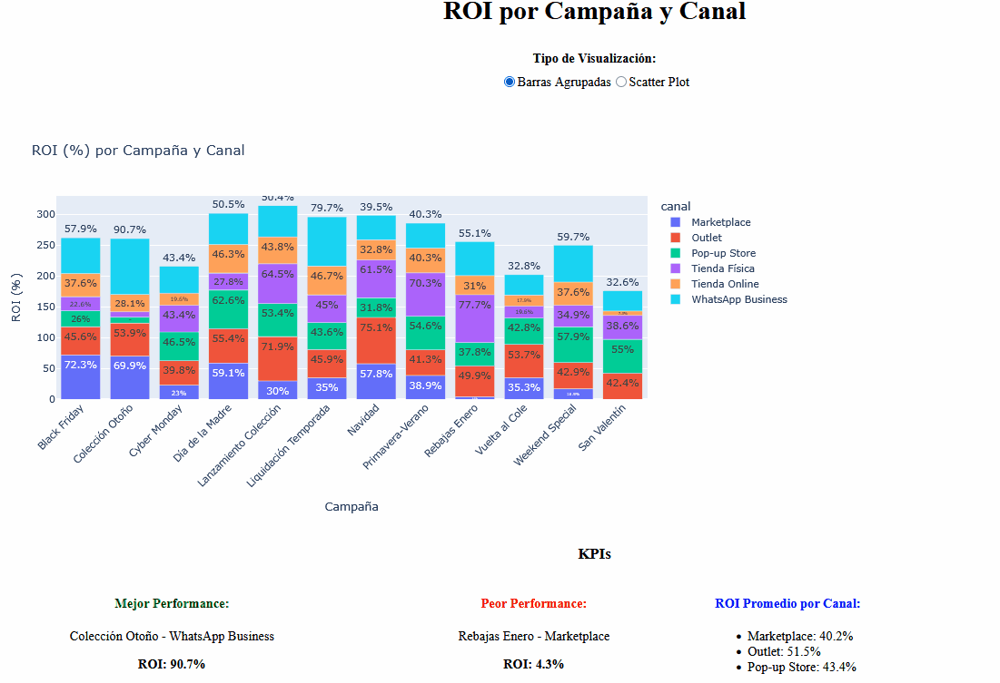
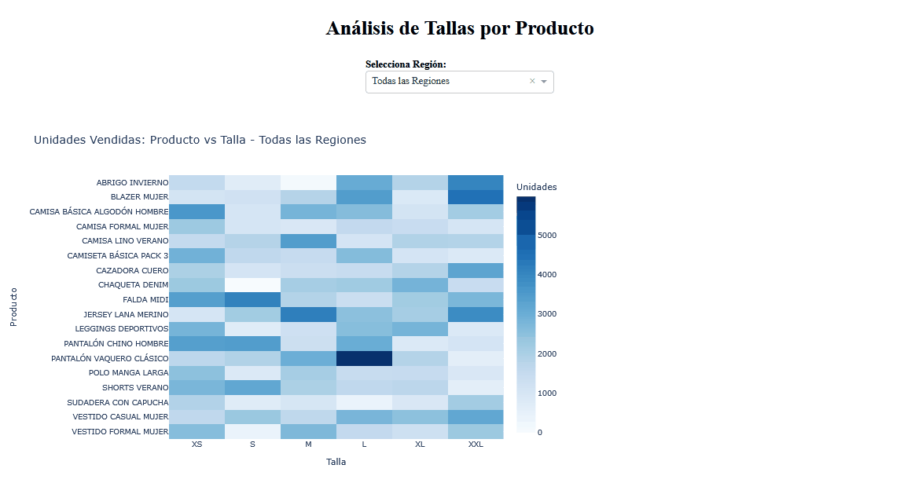

**Portfolio de dashboards**

Dashboards interactivos desarrollados para análisis de datos y business intelligence.

*Proyectos*

- Dashboards de Dash/Python

[*Ventas Moda Analytics 2025*]
- **Descripción:** Dashboards interactivos de análisis de ventas de moda con visualizaciones avanzadas y filtros dinámicos por región, canal y producto.
Funcionalidades: Evolución temporal de ventas por canal, análisis de distribución de tallas por producto, análisis ROI por campaña, comparativa de precios por región, diagramas Sankey de flujo de ventas.
- **Tecnologías:** Dash, Plotly, Python, Pandas

- Dashboards de Tableau

[*Operaciones EasyLoan 2023*]
- **Dashboard:** [Ver Versión Interactiva](https://public.tableau.com/views/PRACTICA_TABLEAU_FERNANDO_APOLO/Dashboard1?:language=es-ES&:sid=&:redirect=auth&:display_count=n&:origin=viz_share_link)
- **Descripción:** Dashboard de operaciones de la empresa EasyLoan del 17 de Julio a 31 de Diciembre de 2023.
- **Tecnologías:** Tableau, Python/SQL

- Dashboards de Power BI

[*KPIs de Ventas Moda 2025*]
- **Descripción:** Dashboard de ventas de moda en España de Enero a Junio de 2025.
- **Tecnologías:** Power BI, DAX, Power Query

**Estructura del repositorio**

dash/

├── ventas_moda_dash.ipynb

└── datos/

tableau/

├── tableau_dashboard_easy_loans.twb

├── tableau_dashboard_easy_loan.pdf

└── datos/

power_bi/

├── portfolio_pbi.pbix

└── datos/

screenshots_gifs/

├── dash_ventas_moda_campaña_canal.gif

├── dash_ventas_moda_mes_canal.gif

├── dash_ventas_moda_precio_medio.gif

├── dash_ventas_moda_producto_talla.gif

├── dash_ventas_moda_roi.gif

├── tableau_easyloans.png

└── pbi_ventas_moda_españa.gif

Contacto

- **LinkedIn:** (https://www.linkedin.com/in/fernando-apolo-%C3%A1lvarez-a4a139343/)
- **Email:** apoloalvarezfernando@gmail.com
